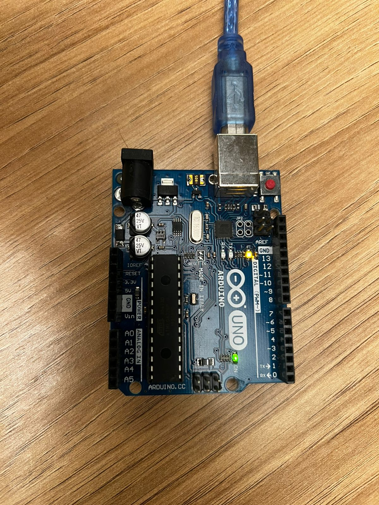
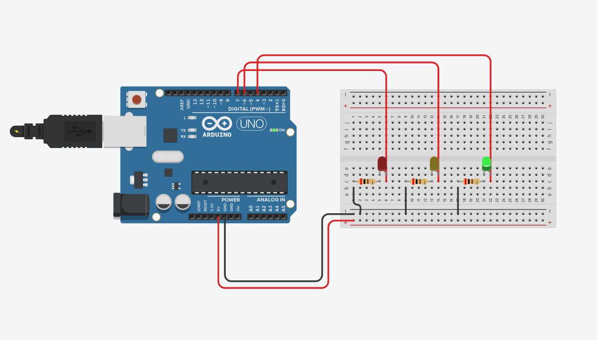
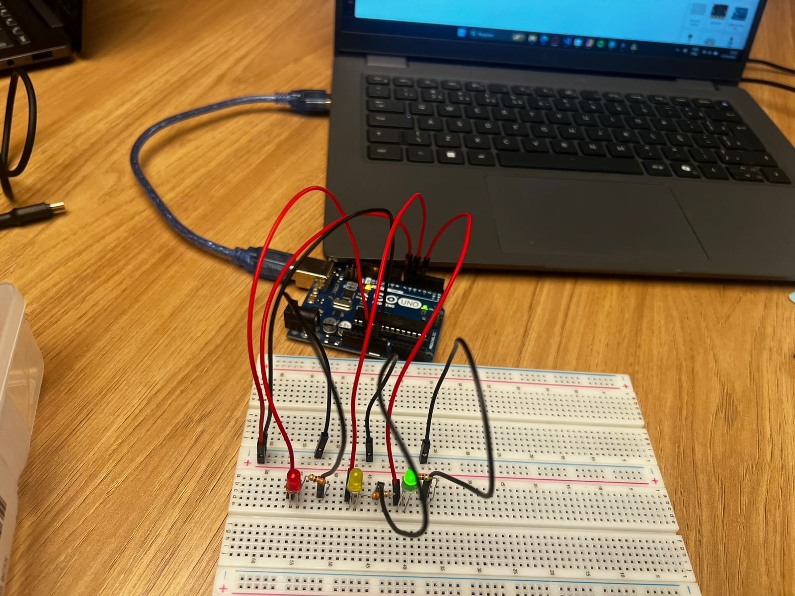

# Ponderada Semana 1

## Informações 

**Nome:** João Pedro Gonçalves Corrêa Araujo
**Turma:** 18, Ateliê 4

## Parte 1

### Instruções

Instale a Arduino IDE em seu computador e assista aos vídeos indicados nos autoestudos conforme o roteiro descrito anteriormente. Você deverá realizar o "blink" com esse LED Interno e postar em seu GitHub as evidências dessa realização.

Você vai fazer o led ficar aceso por um tempo X, apagar e aguardar Y segundos e depois voltar a acender, propondo um loop que gera uma "luz piscando".

⚠️ Entrega Parte 1: em seu GitHub pessoal (usando sua conta com email Inteli), inserir screenshots de sua tela com o IDE e seu código, além de uma fotografia que demonstre seu Arduino ligado no computador e o seu led aceso. Você também poderá enviar um vídeo que evidencie esse funcionamento.

### Entrega

#### Código:

```cpp
void setup() {
  // put your setup code here, to run once:
  pinMode(LED_BUILTIN, OUTPUT);
}

void loop() {
  // put your main code here, to run repeatedly:
  digitalWrite(LED_BUILTIN, LOW);
  delay(1000);
  digitalWrite(LED_BUILTIN, HIGH);
  delay(1000);      
}
```

### Resultado:



## Parte 2

O objetivo da tarefa foi criar um semáforo utilizando 3 leds, um vermelho, um amarelo e um verde. Para isso, definimos a variável **ledVermelho** como um número inteiro no valor **7**, **ledAmarelo** como um número inteiro no valor **6** e o **ledVerde** como um número inteiro no valor **4**, todos com a finalidade de indicar qual porta cada um dos leds está conectado.

Depois disto, dentro da função **setup()** que roda apenas uma vez e define funções básicas, passamos a porta do led guardada em cada uma das variáveis para o comando **pinMode()** e definimos que cada um desses leds estarão em modo **OUTPUT**, ou seja, a informação é mandada do Arduino para os leds.

Já na função **loop()** que é rodada infinitas vezes enquanto o arduino está ligado, definimos a lógica de ligamento dos leds, onde o vermelho é o primeiro a ser iniciado com a duração de 3 segundos, depois o verde com a duração de 2 segundos e por fim o amarelo com duração de 0,5 segundos.

Os comandos utilizados para ligação dos leds é o **digitalWrite()** que de acordo com os parâmetros, manda comandos para as portas específicadas, como **HIGH** para ligar e **LOW** para desligar. Por outro lado, para definir o tempo entre a ligamento e desligamento dos leds, foi utilizado o comando **delay()** que recebe como parâmetro os tempos em milisegundos, ou seja, o comando **delay(5000)** faz com que haja um tempo de 5 segundos antes que o próximo comando seja executado. 


```cpp
int ledVermelho = 7;
int ledAmarelo = 6;
int ledVerde = 4;

void setup() {
  pinMode(ledVermelho, OUTPUT);
  pinMode(ledAmarelo, OUTPUT);
  pinMode(ledVerde, OUTPUT);
}

void loop() {
  digitalWrite(ledVermelho, HIGH);
  delay(3000);
  digitalWrite(ledVermelho, LOW);
  digitalWrite(ledVerde, HIGH);
  delay(2000);
  digitalWrite(ledVerde, LOW);
  digitalWrite(ledAmarelo, HIGH);
  delay(500);
  digitalWrite(ledAmarelo, LOW);
}
```

### Resultado:

Com objetivo de garantir o bom funcionamento do projeto, antes da implementação do modelo físico, foi necessário criar o protótipo na plataforma Tinkercad. Segue a imagem da implementação.

<br>
<div align="center">
<sub>Figura 1: Modelo no TinkerCad.</sub>
</div>
<br>
<div align="center">

</div>
<br>
<div align="center">
<sub>Fonte: Material produzido por João Pedro Gonçalves Corrêa Araujo, 2025.</sub>
</div>
<br>

Depois de implementar o modelo virtual, foi realizada a criação do modelo físico, seguindo as mesmas instruções e códigos do modelo virtual, com objetivo de evitar falhas.

<br>
<div align="center">
<sub>Figura 2: Modelo no Físico.</sub>
</div>
<br>
<div align="center">

</div>
<br>
<div align="center">
<sub>Fonte: Material produzido por João Pedro Gonçalves Corrêa Araujo, 2025.</sub>
</div>
<br>

Também foi produzido um vídeo com o projeto funcionando, segue o vídeo abaixo:

**Vídeo de Funcionamento do Modelo Físico: https://youtu.be/FZcDLNnQd9Q**
