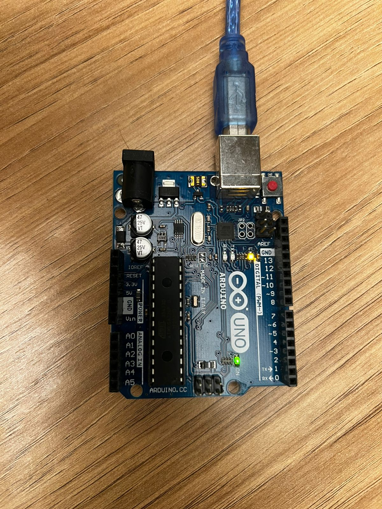

# Ponderada Semana 1

## Informações 

**Nome:** João Pedro Gonçalves Corrêa Araujo
**Turma:** 18, Ateliê 4

## Parte 1

### Instruções

Instale a Arduino IDE em seu computador e assista aos vídeos indicados nos autoestudos conforme o roteiro descrito anteriormente. Você deverá realizar o "blink" com esse LED Interno e postar em seu GitHub as evidências dessa realização.

Você vai fazer o led ficar aceso por um tempo X, apagar e aguardar Y segundos e depois voltar a acender, propondo um loop que gera uma "luz piscando".

⚠️ Entrega Parte 1: em seu GitHub pessoal (usando sua conta com email Inteli), inserir screenshots de sua tela com o IDE e seu código, além de uma fotografia que demonstre seu Arduino ligado no computador e o seu led aceso. Você também poderá enviar um vídeo que evidencie esse funcionamento.

### Entrega

#### Código:

```cpp
void setup() {
  // put your setup code here, to run once:
  pinMode(LED_BUILTIN, OUTPUT);
}

void loop() {
  // put your main code here, to run repeatedly:
  digitalWrite(LED_BUILTIN, LOW);
  delay(1000);
  digitalWrite(LED_BUILTIN, HIGH);
  delay(1000);      
}
```

### Resultado:

